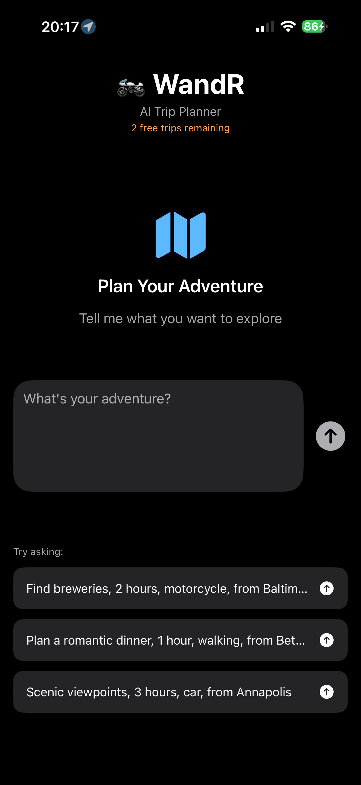
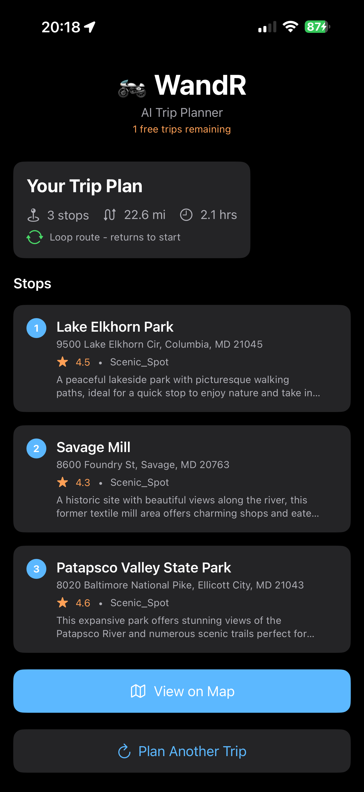
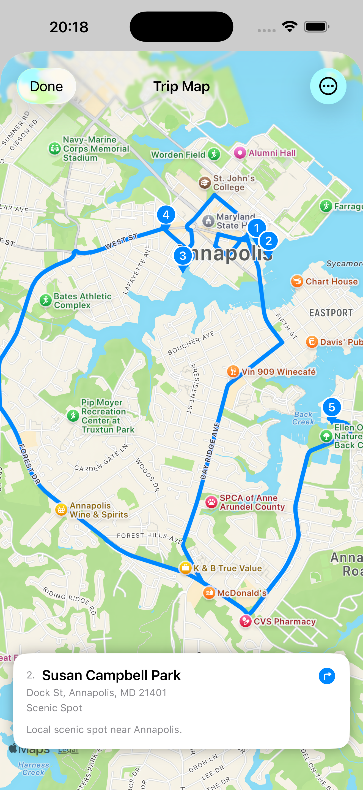
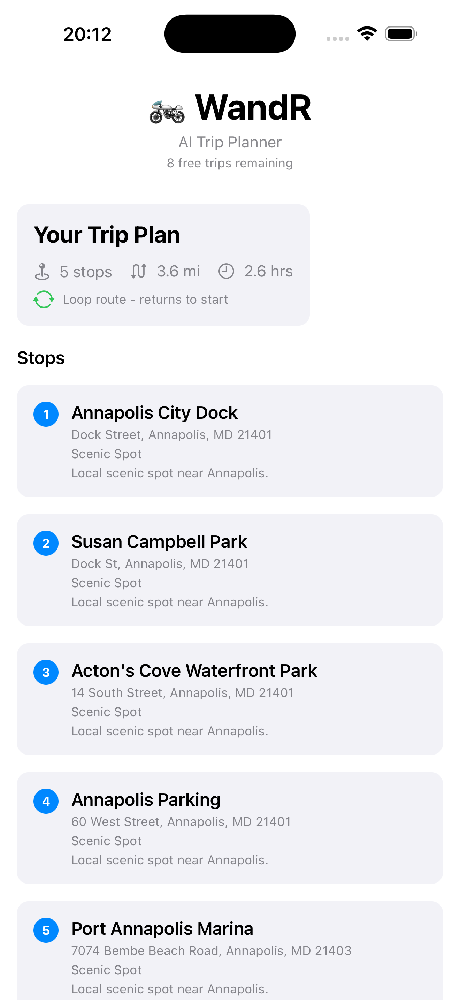

# WandR - AI Agent Trip Planner

> **Where will you wandr today?** Tell WandR what you're in the mood for — it plans the perfect exploration route.

  
  &nbsp;&nbsp;&nbsp;
  
  &nbsp;&nbsp;&nbsp;
  

  
   
  <a href="https://go.fabswill.com/wandr-ios">go.fabswill.com/wandr-ios</a>

[-green)](LICENSE)

---

## What is WandR?

Most trip planners ask *"Where do you want to go?"* — WandR asks *"What do you want to do?"*

WandR is an AI-powered trip planner for explorers without a fixed destination. Just describe what you're in the mood for in plain English, and WandR's AI agents plan an optimized loop route with curated stops — then hand off to Apple Maps for turn-by-turn navigation.

> *"Find breweries, 2 hours, motorcycle, from Baltimore"*
> *"Scenic viewpoints, 3 hours, car, from Annapolis"*
> *"Walking food tour, 1 hour, from Georgetown"*
> *"Romantic dinner spots, 90 minutes, from Bethesda"*

No searching. No scrolling through lists. Just tell WandR what sounds good and go.

---

## See It in Action

  
  &nbsp;&nbsp;&nbsp;&nbsp;
  

  <em>Left: AI plans a 5-stop scenic tour of Annapolis. Right: Real road routes rendered on native MapKit.</em>

---

## Feature Highlights

- **Natural Language Trip Planning** — Describe your mood, time, transport, and starting point. WandR handles the rest.
- **AI-Optimized Loop Routes** — Every trip is a loop. You always end up back where you started.
- **Native Apple Maps Integration** — Real road routes (not straight lines) via MapKit. One tap to open in Apple Maps for navigation.
- **GPS Auto-Detection** — WandR knows where you are. Just say what you want to do.
- **Multi-Modal Travel** — Motorcycle, car, or on foot. WandR plans for how you're getting there.
- **Conversational AI** — If your query is vague, WandR asks follow-up questions to refine the plan.
- **Stop Management** — Don't like a stop? Swipe to remove it. Your route recalculates.
- **Privacy-Respecting** — No accounts, no tracking, no ads. Trip data is processed in-memory and never stored.

---

## Perfect For

| Who | Use Case | Example |
|-----|----------|---------|
| **Motorcyclists** | Scenic rides, brewery crawls, winding road adventures | *"Brewery tour, 3 hours, motorcycle, from Columbia"* |
| **Road Trippers** | Spontaneous day trips, family outings, food tours | *"BBQ joints, 2 hours, car, from DC"* |
| **Walkers & Hikers** | Neighborhood exploration, walking tours | *"Coffee shops and bookstores, 1 hour, walking, Georgetown"* |
| **Tourists** | First-day-in-city discovery, cultural exploration | *"Historic landmarks, 4 hours, car, from Union Station"* |
| **Date Planners** | Unique date itineraries | *"Romantic restaurants with a view, 2 hours, from Bethesda"* |

---

## How It Works

1. **Tell WandR what you want** — Type a natural language query describing your mood, time budget, transport mode, and starting point
2. **AI agents parse your intent** — An orchestrator agent extracts activity type, duration, travel mode, and location from your request
3. **Locations are discovered** — A location scout agent finds relevant, curated stops that match your request
4. **Route is optimized** — A route optimizer plans the most efficient loop using a greedy TSP algorithm
5. **Map shows your adventure** — See your complete route with numbered pins on a native MapKit map with real road routes
6. **Navigate with Apple Maps** — Tap any stop to get turn-by-turn directions via Apple Maps

---

## Pricing

| Tier | What You Get |
|------|-------------|
| **Free** | 10 trip plans — no account required |
| **WandR Pro** | Unlimited trip plans via monthly subscription |

Subscriptions are managed by Apple. Cancel anytime in iOS Settings.

---

## Privacy First

WandR is designed with privacy at its core:

- **No accounts** — No email, no sign-up, no personal identity collected
- **No tracking** — No analytics, no IDFA, no cross-app tracking
- **No ads** — Ever
- **No data storage** — Trip queries are processed in-memory and discarded after your route is returned
- **Minimal permissions** — Location is the only permission, and it's optional (you can type a starting point instead)

Read the full [Privacy Policy](PRIVACY.md) and [Terms of Service](TERMS.md).

---

## FAQ

<strong>Is WandR free?</strong>

Yes! You get 10 free trip plans with no account required. After that, WandR Pro gives you unlimited trips via a monthly subscription.

<strong>Does WandR work offline?</strong>

No. WandR requires an internet connection to communicate with the AI backend and generate trip plans. Once your route is displayed, you can hand off to Apple Maps for navigation.

<strong>How accurate are the AI suggestions?</strong>

WandR uses AI to find locations based on its training data. Most suggestions are accurate for well-known, established places. However, AI suggestions may not reflect very recent openings or closures — always verify a location is open before visiting.

<strong>What if I don't like one of the stops?</strong>

Swipe to remove any stop you don't want. Your route stays optimized with the remaining stops.

<strong>Do I need to share my location?</strong>

No. Location permission is optional. If you deny it, you can type your starting point manually (e.g., "from Baltimore" or "from 123 Main St").

<strong>What transport modes are supported?</strong>

Motorcycle, car, and walking. Just include it in your query (e.g., "motorcycle" or "on foot").

<strong>Can I use WandR outside the US?</strong>

WandR works anywhere Apple Maps has coverage. The AI agent will find locations globally, though coverage is best in the US.

<strong>How do I cancel my subscription?</strong>

Go to iOS Settings → [Your Name] → Subscriptions → WandR → Cancel. Apple handles all billing.

<strong>Does WandR sell my data?</strong>

No. We don't sell, share, or monetize your data in any way. See our <a href="PRIVACY.md">Privacy Policy</a>.

<strong>What iOS version do I need?</strong>

iOS 17.0 or later.

---

## Technical Details

| Component | Details |
|-----------|---------|
| **Platform** | iOS 17.0+ |
| **Framework** | SwiftUI |
| **Maps** | MapKit (native — no Google Maps dependency) |
| **Architecture** | MVVM |
| **Backend** | Python, FastAPI, Azure Container Apps |
| **AI** | Multi-agent swarm (Orchestrator + Location Scout + Route Optimizer) |
| **LLM** | OpenAI GPT-4o-mini |
| **Routing** | Greedy TSP algorithm (custom) |
| **Subscriptions** | RevenueCat + Apple StoreKit 2 |
| **Observability** | OpenTelemetry, Azure Monitor |

---

## Roadmap

We're actively improving WandR. Here's what's on the horizon:

- **Real-time location search** — Bing Grounding via Azure AI Foundry for up-to-the-minute location data
- **Trip history** — Save and revisit your favorite routes
- **Share trips** — Send your planned routes to friends
- **Favorites** — Star stops you loved for future trips
- **Multi-day trips** — Plan adventures that span multiple days
- **More transport modes** — Bicycle support, public transit awareness

Have an idea? [Request a feature](https://github.com/fabianwilliams/wandr-community/issues/new?template=feature_request.md).

---

## Feedback & Support

This is the **community hub** for WandR. Use it to:

- [Report a bug](https://github.com/fabianwilliams/wandr-community/issues/new?template=bug_report.md)
- [Request a feature](https://github.com/fabianwilliams/wandr-community/issues/new?template=feature_request.md)
- [Ask a question](https://github.com/fabianwilliams/wandr-community/issues/new)
- Read the [Privacy Policy](PRIVACY.md) and [Terms of Service](TERMS.md)
- Read how to [Contribute](CONTRIBUTING.md)

**Email:** support@adotob.com
**Response time:** Within 48 hours

---

## License

The documentation in this repository is licensed under the [MIT License](LICENSE). The WandR iOS app itself is proprietary software owned by Adotob LLC.

---

## About

Built by **Fabian G. Williams** ([@fabianwilliams](https://github.com/fabianwilliams))
7x Microsoft MVP | Principal PM | AI/Agent Systems Enthusiast

WandR is developed by [Adotob LLC](https://adotob.com) — Maryland, United States

**Also by the same developer:**
- [Stale Contacts Cleaner](https://github.com/fabianwilliams/stale-contacts-cleaner) — Clean up your iPhone contacts in seconds

---

## Quick Links

| Link | Description |
|------|-------------|
| [App Store](https://apps.apple.com/us/app/wandr-ai-agent-trip-planner/id6759307325) | Download WandR |
| [Short Link](https://go.fabswill.com/wandr-ios) | go.fabswill.com/wandr-ios |
| [Report a Bug](https://github.com/fabianwilliams/wandr-community/issues/new?template=bug_report.md) | Found something broken? |
| [Request a Feature](https://github.com/fabianwilliams/wandr-community/issues/new?template=feature_request.md) | Have an idea? |
| [Privacy Policy](PRIVACY.md) | How we handle your data |
| [Terms of Service](TERMS.md) | Usage terms |
| [Contributing](CONTRIBUTING.md) | How to participate |

---

*Launched March 2026 | Made with AI-augmented development using Claude Code*
